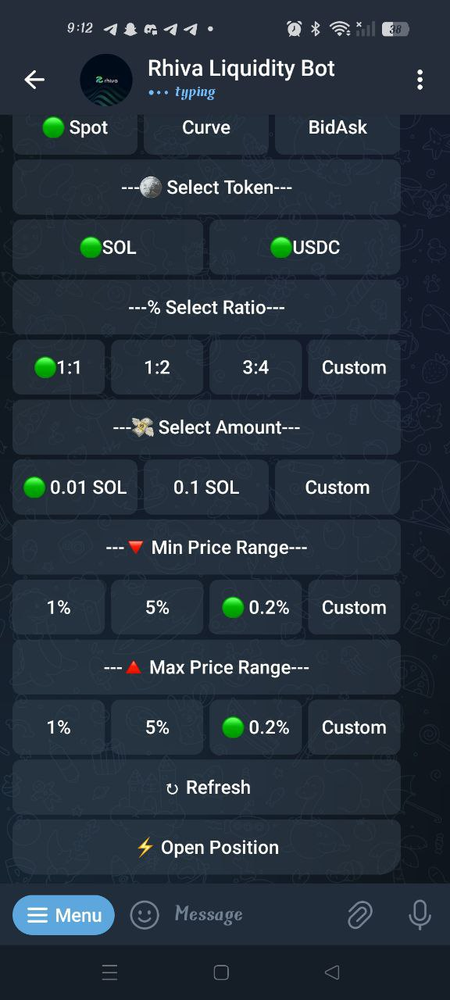

# Rhiva's Telegram Bot

Rhiva’s Bot brings our core product, `Liquidity aggregration` directly into your Telegram app, giving you instant access to insights and automated actions without opening our web dashboard.

<figure style="text-align:center;">
  
  <figcaption>Rhiva Telegram Bot</figcaption>
</figure>        

## What the Bot Provides
Our Telegram Bot delivers realtime insights, historical datapoints, and essential analytics in a simple and interactive chat interface. 
Designed for both beginners and advanced users, it helps you make informed decisions effortlessly.

Key advantages include:
- Instant summaries of historical data.
- Quick access to key metrics and pool performance.
- Clear breakdowns of fees, exposure, IL, and volatility.
- Simple text commands that replace complex dashboards.

## Additional Features
Rhiva’s bot leverages AI to analyze data and offer actionable recommendations automatically.
It can also execute repetitive or advanced tasks on your behalf, such as:

- Rebalancing
- Repositioning
- Auto-claiming
- Auto-compounding

This reduces manual workload, improves efficiency.

>Experience a seamless blend of automation, analytics, and simplicity, all within your Telegram chat. Let Rhiva help you make smarter decisions and achieve better outcomes.
