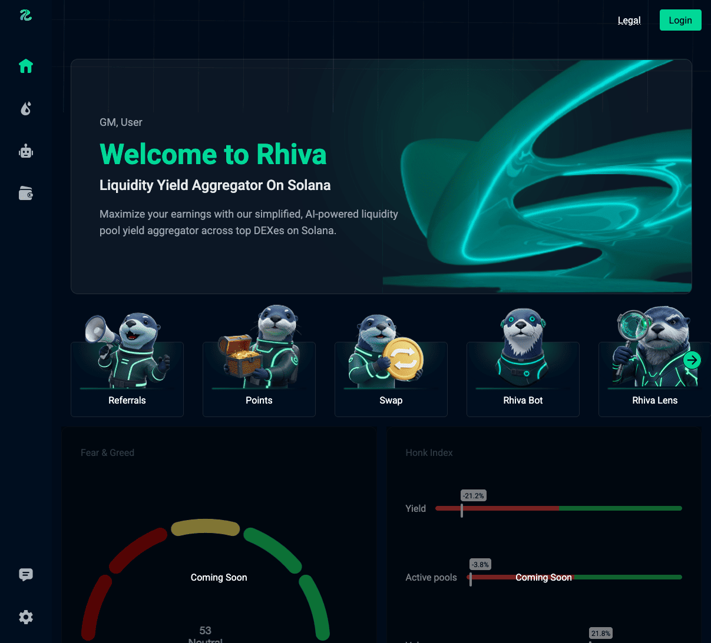

# Rhiva's Web
Rhiva combines smart data, AI driven analysis, autonomous execution, and an intuitive interface to simplify
complex processes and help users maximize returns effortlessly.
<figure style="text-align:center;">
  
  <figcaption>Rhiva.fun</figcaption>
</figure>        

## What We Provide
We provide an intuitive web dashboard that provides our user with Liquidity pools insights, historical datapoints and more.
Our dashboard is designed to make data driven decision making accessible to everyone, even without technical expertise.
Interactive and visually appealing charts that display historical datapoints and key metrics at a glance.
  Comprehensive controls and metrics that allow users to monitor liquidity performance, adjust parameters, 
  and optimize strategies.

## Additional Features
Leveraging artificial intelligence to analyze data and provide actionable recommendations automatically.
Let Rhiva handle repetitive or complex tasks like rebalancing, repositioning, autoclaim and autocompounding on your behalf, 
improving efficiency and reducing human error.

>Experience a seamless combination of automation, analytics, and simplicity 
all designed to help you make smarter decisions and achieve better outcomes.
