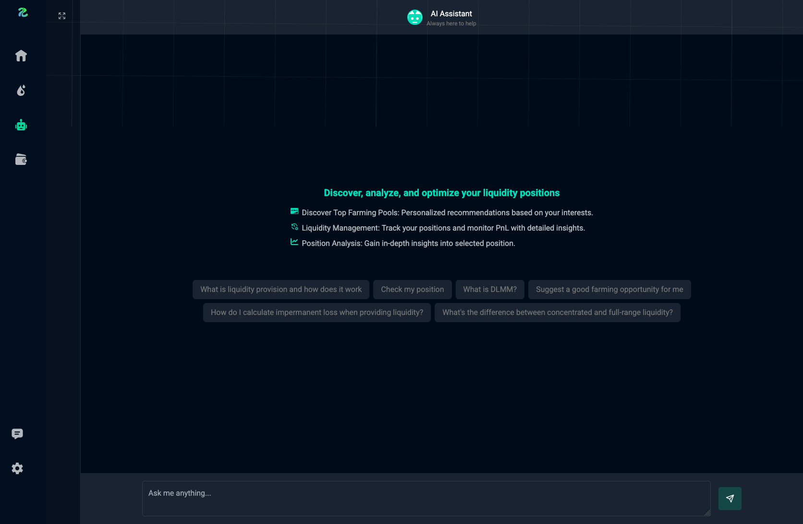

# AI
Rhiva AI Assistant is an intelligent agent integrated with our platform for analyzing data, making recommendations, and performing other tasks.

<figure style='margin: auto; display: flex; flex-direction: column; align-items: center; justify-content: center;'>
  
  <figcaption>Rhiva AI Assistant</figcaption>
</figure>

## What Can Rhiva Do?
Our AI agent can perform a variety of tasks. Some of the tasks you can assign to our AI agent include:
- Token data analysis and recommendations
- Pool yield analysis and recommendations

> Currently, automated tasks are not supported. We are improving the AI agent to enable these features in the future.

## Chat History
Click on the side rails to view chat histories. You can continue a conversation by clicking on a chat.

> This UI is subject to change with prior notice. We are always improving our AI agent, so please check the documentation regularly for new changes and release notes.
