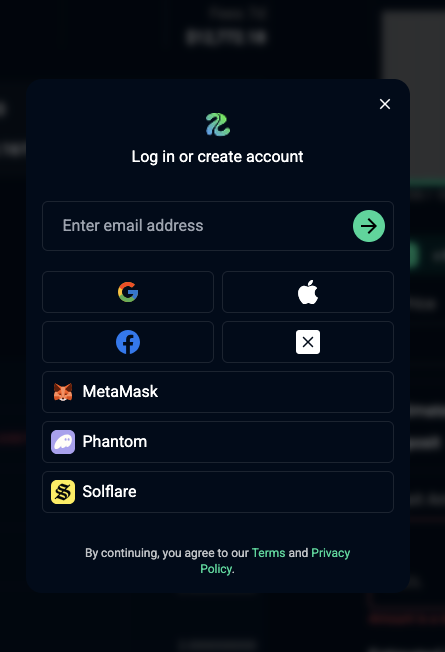

# Sign Up
Connect your wallet or log in using social accounts to access Rhiva. We automatically generate a custodian wallet when you log in with social accounts.

<figure style='margin: auto; display: flex; flex-direction: column; align-items: center; justify-content: center;'>
  
  <figcaption>Login to Rhiva</figcaption>
</figure>

## Email Link
You can log in with your email address, and we will send you a login link.  
When you log in for the first time, a secure custodian wallet will be created on your behalf. Fund your wallet to start providing liquidity with Rhiva.

## Social Accounts
You can log in with your Google account, Apple, and more.  
When you log in for the first time, a secure custodian wallet will be created on your behalf. Fund your wallet to start providing liquidity with Rhiva.

## External Wallets
Connecting an external wallet will use your existing wallet by default.  
You can also sign in to generate a secure custodian wallet, which enables automation features.

> Email Link and Social Login generate a custodian wallet by default, which means automation is enabled automatically.
