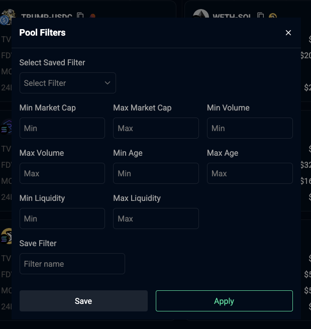
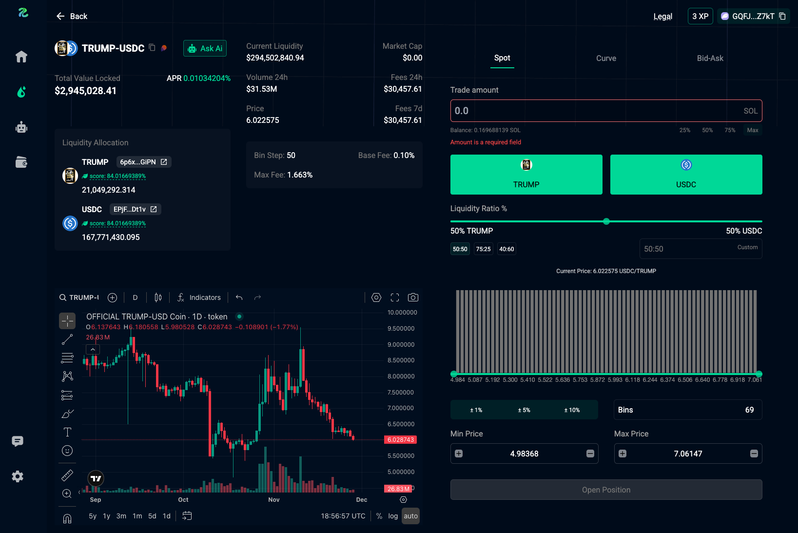

# Messages
View, filter and search trending pools list. Supports timeframe sort and custom filter presets.

<figure style='margin: auto; display: flex; flex-direction: column; align-items: center; justify-content: center;'>
  
  <caption>Pools Page</caption>
</figure>

## Search
You can search for pools by name, symbol and token contract addresses. We sort pools by volume when searching.

## Filter
Use the filter button for detailed filter. You can save a filter preset and reuse.
<figure style='margin: auto; display: flex; flex-direction: column; align-items: center; justify-content: center;'>
  
  <caption>Filter Dialog</caption>
</figure>

## Sort
You can sort token list by `timeframe`, `TVL`, `Age`, supported timeframes include:
- 5 minutes 
- 1 hours 
- 6 hours 
- 24 hours

## Pool Info
Each pool shows dex logo, name and token image is shown with `TVL`, `FDV`, `MCap`, `24H VOL`
this changes with timeframe selected. 
<figure style='margin: auto; display: flex; flex-direction: column; align-items: center; justify-content: center;'>
  
  <caption>Click on a pool to show more pool information.</caption>
</figure>

