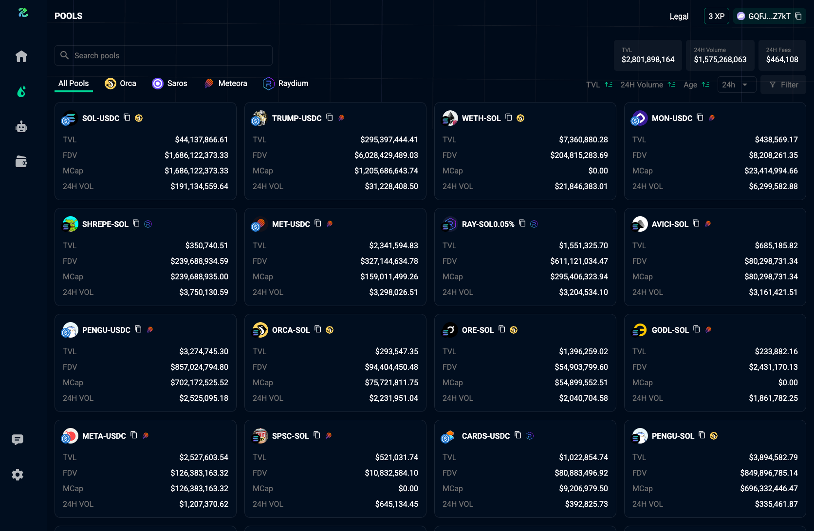

# Pools
View, filter, and search trending pools. The list supports sorting by timeframe and using custom filter presets.

<figure style='margin: auto; display: flex; flex-direction: column; align-items: center; justify-content: center;'>
  
  <figcaption>Pools Page</figcaption>
</figure>

## Search
You can search for pools by name, symbol, or token contract addresses. Search results are sorted by volume.

## Filter
Use the filter button to access detailed filtering options. You can save filter presets and reuse them.

<figure style='margin: auto; display: flex; flex-direction: column; align-items: center; justify-content: center;'>
  
  <figcaption>Filter Dialog</figcaption>
</figure>

## Sort
You can sort the pool list by `timeframe`, `TVL`, or `Age`. Supported timeframes include:
- 5 minutes
- 1 hour
- 6 hours
- 24 hours

## Pool Info
Each pool displays the DEX logo, pool name, and token image, along with `TVL`, `FDV`, `MCap`, and `24H Volume`.  
These metrics update according to the selected timeframe.

<figure style='margin: auto; display: flex; flex-direction: column; align-items: center; justify-content: center;'>
  
  <figcaption>Click on a pool to view more detailed information.</figcaption>
</figure>
