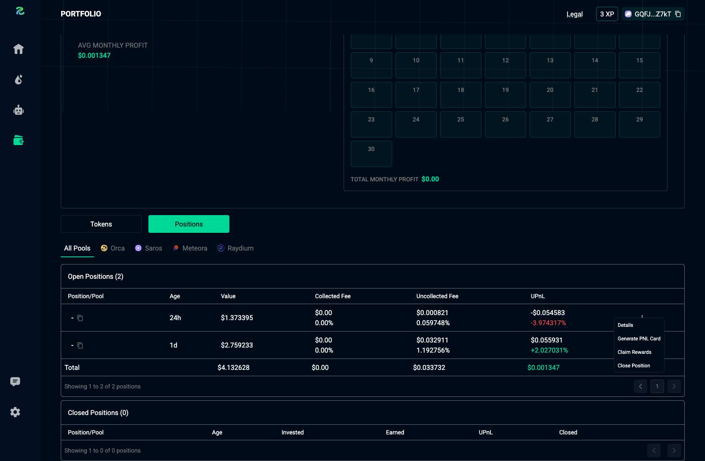
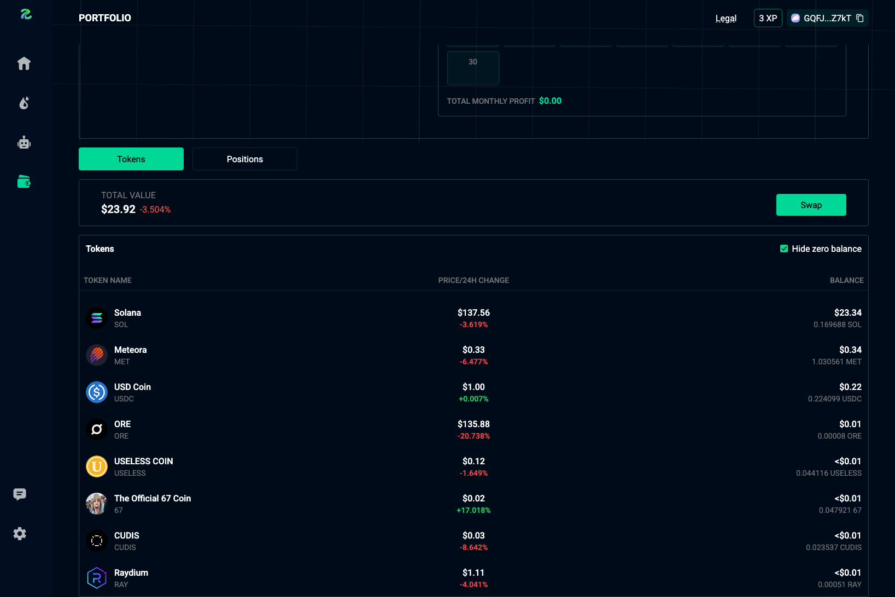

# Portfolio
You can view detailed information about your token and liquidity positions. We also provide a summary of your daily earnings and PnLs.

<figure style='margin: auto; display: flex; flex-direction: column; align-items: center; justify-content: center;'>
  
  <figcaption>Portfolio Page</figcaption>
</figure>

## Tokens
View your tokens, and send, receive, or swap them using your custodian wallet.

<figure style='margin: auto; display: flex; flex-direction: column; align-items: center; justify-content: center;'>
  
  <figcaption>Token List</figcaption>
</figure>

## Positions
View your open and closed positions, and manage your active positions here.

<figure style='margin: auto; display: flex; flex-direction: column; align-items: center; justify-content: center;'>
  
  <figcaption>Position List</figcaption>
</figure>
