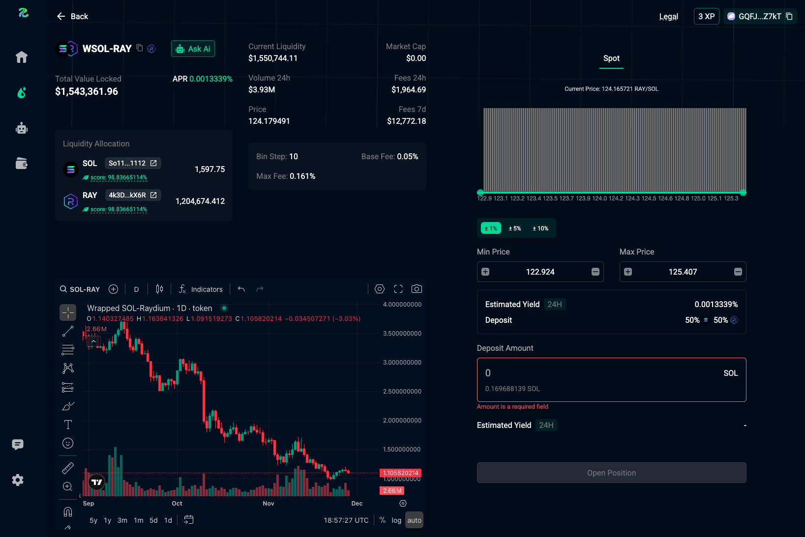
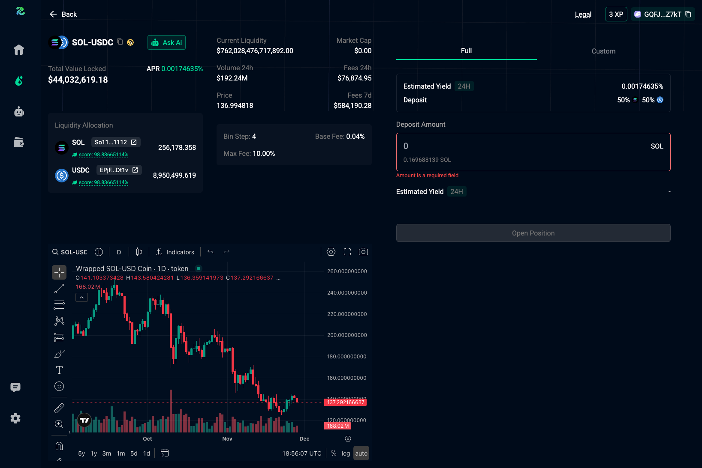
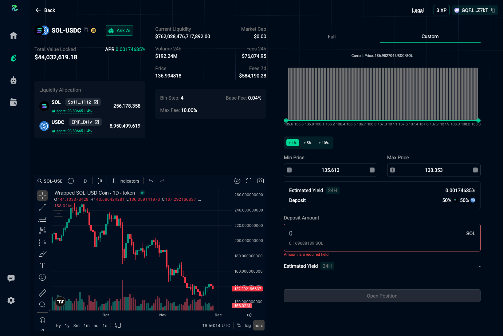

# Opening Position

Opening a position across multiple DEXes differs slightly for each platform.  
We provide detailed guides on how to open a position for each supported DEX.

## Meteora
Opening a position on Meteora uses the following interface:

<figure style='margin: auto; display: flex; flex-direction: column; align-items: center; justify-content: center;'>
  
  <figcaption>Open Position for a Meteora Pool</figcaption>
</figure>

## Raydium
Opening a position on Raydium uses the following interface:

<figure style='margin: auto; display: flex; flex-direction: column; align-items: center; justify-content: center;'>
  
  <figcaption>Open Position for a Raydium Pool</figcaption>
</figure>

## Orca
### Full Range Position
Opening a full-range position on Orca uses the following interface:

<figure style='margin: auto; display: flex; flex-direction: column; align-items: center; justify-content: center;'>
  
  <figcaption>Open Full Range Position for an Orca Pool</figcaption>
</figure>

### Custom Range Position
Opening a custom-range position on Orca uses the following interface:

<figure style='margin: auto; display: flex; flex-direction: column; align-items: center; justify-content: center;'>
  
  <figcaption>Open Custom Range Position for an Orca Pool</figcaption>
</figure>
