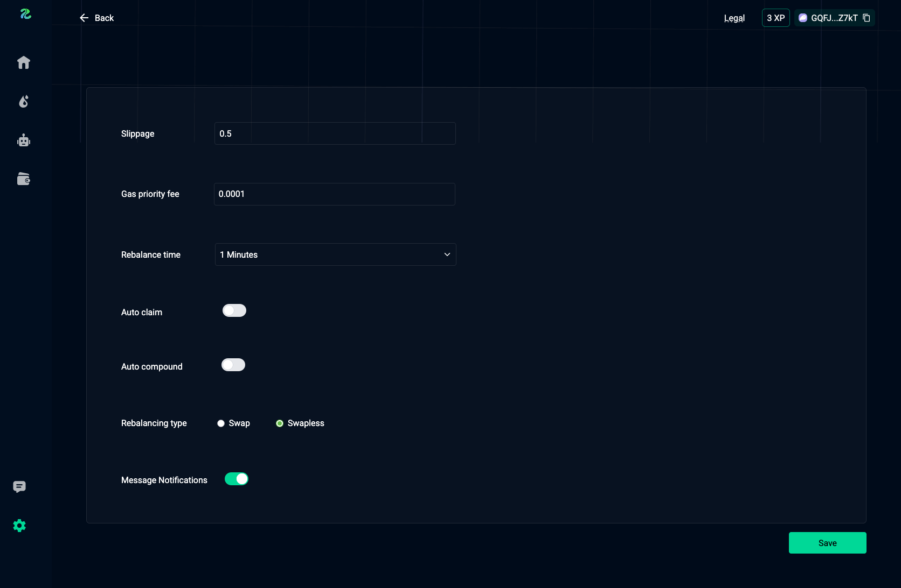

# Settings
Here you can manage your account settings, including:
- Edit slippage
- Set gas priority fee
- Set rebalance time
- Enable or disable AutoClaim
- Enable or disable AutoCompound
- Set rebalancing type
- Turn off message notifications

<figure style='margin: auto; display: flex; flex-direction: column; align-items: center; justify-content: center;'>
  
  <figcaption>Settings Page</figcaption>
</figure>

## Slippage
Set the swap and position slippage percentage.  
This helps protect you against MEV attacks from sniping bots.

## Gas Priority Fee
Set the priority fee for faster transaction confirmation.  
We send transactions using Jito Bundles.

## Rebalance Time
Set the time at which we should rebalance or reposition your positions when they fall out of range.

## AutoClaim
Automate claim tasks by enabling this feature. It is turned off by default.

## AutoCompound
This works together with AutoClaim. Claimed rewards are automatically reinvested into the pool.  

> We recommend enabling this when concentrating liquidity in a tight range and using a larger capital, to prevent fund loss when adding micro tokens.

## Rebalancing Type
- **Swap Rebalancing**  
  Withdraw and convert tokens to native tokens, then attempt to rebalance the position.  
- **Swapless Rebalancing**  
  Withdraw tokens and attempt to rebalance the position without swapping.
>We always recommend swapless rebalancing to prevent fund loss due to swap slippage, it is selected by default.