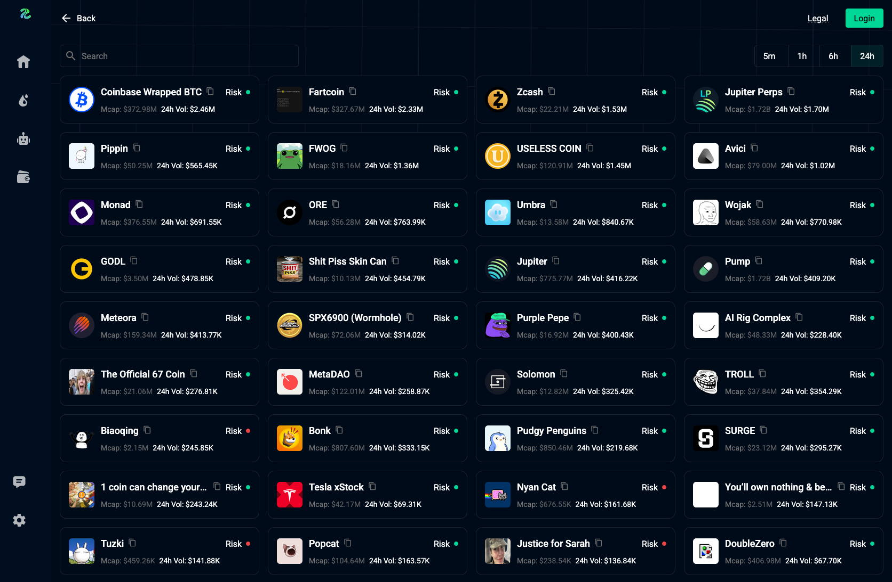
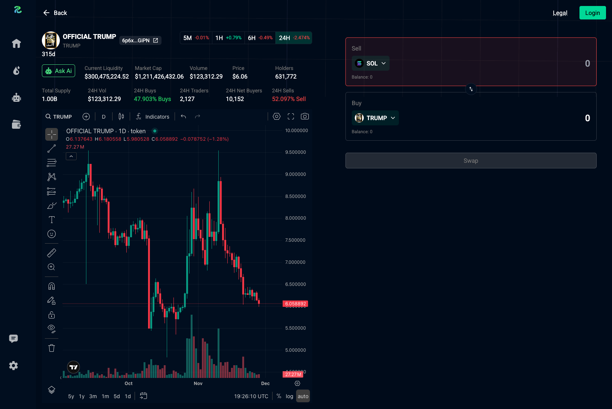

# Tokens
View, filter, and search trending tokens. The list supports sorting by different timeframes.

<figure style='margin: auto; display: flex; flex-direction: column; align-items: center; justify-content: center;'>
  
  <figcaption>Tokens Page</figcaption>
</figure>

## Search
You can search for a token by name, symbol, or contract address. Search results are sorted by trading volume.

## Timeframe Filter
You can sort the token list by timeframe. Supported timeframes include:
- 5 minutes
- 1 hour
- 6 hours
- 24 hours

## Token Info
Each token displays its `Market Cap` (MCap), `24h Volume` changes according to the selected timeframe, and a risk check indicator.

<figure style='margin: auto; display: flex; flex-direction: column; align-items: center; justify-content: center;'>
  
  <figcaption>Click on a token to view more detailed information.</figcaption>
</figure>

> The risk check is provided by Jupiter and uses specific criteria that a token must meet to pass the assessment.
